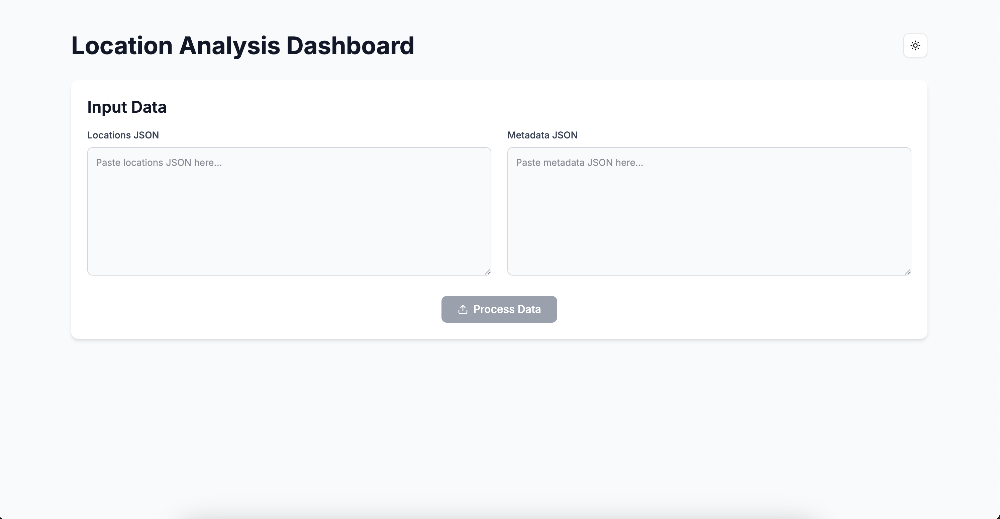

# Location Analysis Dashboard

A modern web application for analyzing location and metadata information with a beautiful dark mode interface. View the live demo at [https://coreshield-assignment.vercel.app/](https://coreshield-assignment.vercel.app/)



## Features

- 📊 Analyze location data and metadata
- 🌓 Dark mode support
- 📱 Responsive design
- ✨ Modern UI with Tailwind CSS
- 🔍 Advanced data validation
- 📈 Statistical analysis
- 🚀 Built with Next.js and TypeScript

## Data Format

### Locations JSON
```json
[
  {"id": "loc_01", "latitude": 37.7749, "longitude": -122.4194},
  {"id": "loc_04", "latitude": 27.8749, "longitude": 122.4194},
  {"id": "loc_05", "latitude": 57.2749, "longitude": -112.4344}
]
```

### Metadata JSON
```json
[
  {"id": "loc_01", "type": "restaurant", "rating": 4.5, "reviews": 120},
  {"id": "loc_04", "type": "restaurant", "rating": 4.1, "reviews": 500},
  {"id": "loc_05", "type": "restaurant", "rating": 3.7, "reviews": 110}
]
```

## Analysis Features

- Count of locations per type (restaurants, hotels, cafes, etc.)
- Average rating calculation per type
- Total reviews per type
- Identification of most reviewed location
- Detection of locations with incomplete data

## Technology Stack

- Next.js 14
- TypeScript
- Tailwind CSS
- next-themes (dark mode)
- Lucide React (icons)

## Getting Started

1. Clone the repository:
```bash
git clone https://github.com/yourusername/location-analysis-dashboard.git
```

2. Install dependencies:
```bash
npm install
# or
yarn install
# or
bun install
```

3. Run the development server:
```bash
npm run dev
# or
yarn dev
# or
bun dev
```

4. Open [http://localhost:3000](http://localhost:3000) in your browser.

## Usage

1. Paste your locations JSON data into the first textarea
2. Paste your metadata JSON data into the second textarea
3. Click "Process Data" to analyze
4. View the results in the cards below

## Data Validation

The application performs thorough validation of input data:
- Validates JSON format
- Ensures data is in array format
- Checks for required fields and correct types
- Provides specific error messages for invalid data

## Contributing

Feel free to submit issues and enhancement requests!

## License

MIT License - feel free to use this project for your own purposes.

## Acknowledgments

- Icons by [Lucide](https://lucide.dev/)
- Dark mode implementation using [next-themes](https://github.com/pacocoursey/next-themes)
- UI components styled with [Tailwind CSS](https://tailwindcss.com/)